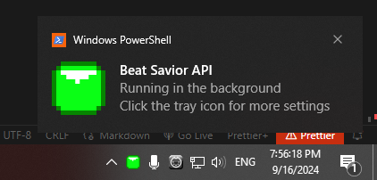
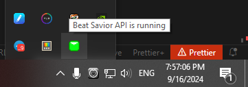

# Beat Savior API
A client-side server providing a convinient way to access your [Beat Savior](https://github.com/Mystogan98/BeatSaviorData) statistics with WebSocket support. 

> [!IMPORTANT]
> You have to have [Beat Savior Data Plugin](https://github.com/Mystogan98/BeatSaviorData) installed for the API to work.

> [!TIP]
> This program only provides a way to access the data. It does not construct overlays or display any data by itself. Check the [Examples folder](examples/) or the [Examples section](#example-usage) for integration examples.

## Usecases

- Stream overlay with live data
- External statistics screen for VR arcades
- Beat Saber tournament live data capture and analysis
- Local Beat Saber statistics backup

## How does it work?
Every time a custom song is played, Beat Savior records its data into a session file, located in your AppData folder (`AppData/Roaming/Beat Savior Data`). Beat Savior API server then indexes that folder, builds a database copy and enables you to access it over the network.

Even if the original files would be lost, you can still access your saved replay data via Beat Savior API. You can also transfer the database file to another machine or back it up, just like a regular file.

Upon launch, the program minimizes itself to your system tray. You can monitor the status by looking at the color of the icon and hovering over it to get more detailed info.
You can also access quick settings by clicking on it.

 

Here is a quick reference guide for all the icons:
|  Icon                                                                                      | Description | 
|                                   :---:                                                    | ---         |
| | Beat Savior API is ready and running |
| | Beat Savior API is currently busy and API may not be available. Please wait |
| | Beat Savior API is running, but some features may not be available |
| | Beat Savior API is running and open to external requests (Open to LAN) |
| | Beat Savior API encountered a critical error and cannot continue |

## Installation or update
> [!IMPORTANT]
> When running the program for the first time, it needs some time to build a database and back-up all of your statistics. It may take a long time, depending on how many files you have. Please be patient. The program would notify you when it is ready.

1. Download the desired version from the [releases tab](https://github.com/Alex-Dash/beat-savior-api/releases)
1. Stop all currently running instances of Beat Savior API (click the system tray icon and choose "Quit")
1. Extract the whole `bsvapi` folder to your desired location. (Do not launch it from the archive!)
1. Double-click the `bsvapi.exe` to launch.

## API Documentation

> [!NOTE]
> This section is still WIP.

## Example usage
This section contains some example projects that you can modify to your liking.

| Name                                                              | Features      | Difficulty |
| ---                                                               | ---           |    :---:   |
| [Basic OBS overlay on song finish](examples/obs_basic_renderer/)  | WebSocket API |    ●●○○○   |

## Roadmap
- [x] WebSocket - notification on new song data
- [ ] REST API - a way to browse the data using GET and POST requests
- [ ] WebSocket - API for accessing per-note statistics
- [ ] WebSocket - notification on new session data
- [ ] WebSocket - notification on new/changed header/settings data
- [ ] General - "Update available" notification